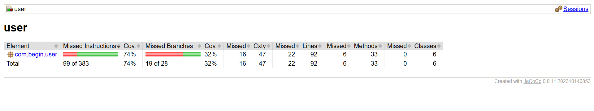
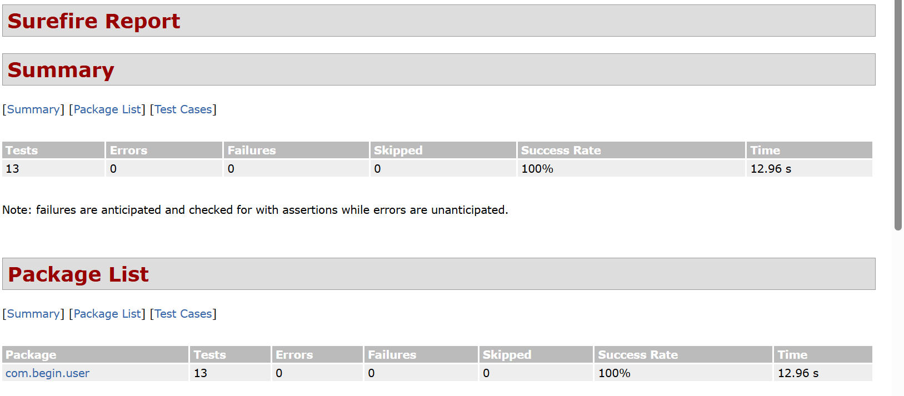

# API Server Project

## 🌐 Base URL
`# API Server Project`

A simple **User Management API** that allows registering, authenticating, viewing, updating, and deleting users. It also includes a frontend UI using Thymeleaf or JSP templates.

---

## 📦 Entity: User

| Field     | Type   | Description                       |
|-----------|--------|-----------------------------------|
| id        | int    | Unique identifier (Primary Key)   |
| name      | string | Name of the user                  |
| username  | string | Username (must be unique)         |
| email     | string | Email address (must be unique)    |
| password  | string | Password                          |

---

## 🌐 Base URL

`http://localhost:1012/users`
---

## 🔁 API Endpoints

### 1. Load User UI Page

- **Method:** GET  
- **URL:** `/users/UI_Page`  
- **Description:** Loads the HTML UI page for user management.  
- **Response:** Renders the Thymeleaf or JSP template named `kp`.  
- **Usage:** Visit in browser → `http://localhost:1012/users/UI_Page`  
  Displays signup/login forms.

---

### 2. User Signup

- **Method:** POST  
- **URL:** `/users/signup`  
- **Description:** Registers a new user.  
- **Response:** Redirects to `kp` template  
- **Model Attributes:** `message`, `user`  
- **Usage:** Submit form from UI  
  Handles duplicate emails and shows error if any.

---

### 3. User Login

- **Method:** POST  
- **URL:** `/users/login`  
- **Description:** Authenticates a user.  
- **Response:** Redirects to `kp` template  
- **Model Attributes:** `message`, `user`  
- **Usage:** Submit login form from UI  
  Shows welcome message on success.

---

### 4. List All Users (API)

- **Method:** GET  
- **URL:** `/users`  
- **Description:** Retrieves all users as JSON.  
- **Response:** List of User objects  
- **Usage:**  
  `http://localhost:1012/users` via Postman or browser

---

### 5. Get User by ID (API)

- **Method:** GET  
- **URL:** `/users/{id}`  
- **Description:** Retrieve a specific user  
- **Response:** User JSON or 404  
- **Usage:**  
  `http://localhost:1012/users/1`

---

### 6. Update User (API)

- **Method:** PUT  
- **URL:** `/users/{id}`  
- **Description:** Update user details  
- **Response:** Updated user or null if not found  
- **Usage:** Send PUT request with user JSON

---

### 7. Delete User (API)

- **Method:** DELETE  
- **URL:** `/users/{id}`  
- **Description:** Delete a user by ID  
- **Response:** 200 OK  
- **Usage:** Send DELETE request

---

## 🔐 CORS Configuration

| Setting              | Value                    |
|----------------------|--------------------------|
| Allowed Origins      | IPv4 address             |
| Allowed Methods      | GET, POST, PUT, DELETE   |
| Allowed Headers      | `*`                      |
| Allow Credentials    | `true`                   |

---

## 📋 Summary Table

| Endpoint             | Method | Description             | Response Type  |
|----------------------|--------|-------------------------|----------------|
| `/users/UI_Page`     | GET    | Load UI page            | HTML           |
| `/users/signup`      | POST   | Register user           | HTML + Model   |
| `/users/login`       | POST   | Authenticate user       | HTML + Model   |
| `/users`             | GET    | List all users          | JSON           |
| `/users/{id}`        | GET    | Get user by ID          | JSON           |
| `/users/{id}`        | PUT    | Update user             | JSON           |
| `/users/{id}`        | DELETE | Delete user             | JSON (status)  |

---

## ✅ Technologies Used

- Java
- Spring Boot
- Thymeleaf or JSP
- MySQL
- Maven
- JUnit 5
- Mockito
- Spring MVC Test (MockMvc)
- JaCoCo
---

## 📌 Features
- Signup and login (JSON & Form)
- User CRUD: Get, Create, Update, Delete
- Login validation
- Admin dashboard (optional frontend)

## 🚀 How to Run

1. **Clone the repository**  
   ```bash
   git clone https://github.com/tridha21/api-server-project.git
   
2. **Create your database**
   ```
   Make sure your MySQL service is running and the database is correctly configured in application.properties.
   ```
3. **Run the server:**
   ```
   mvn spring-boot
   ```
## 🧪 How to Run Tests
      ```
      mvn clean test
    
      ```
## 📈 Code Coverage

Test coverage was measured using **JaCoCo**, and tests were executed using **Surefire** (`mvn test`).

### ✅ Unit Test Coverage

Unit tests were written using **JUnit** and **Mockito** to cover core business logic and service layer behavior.



### ✅ API Test Coverage

API tests were executed using **MockMvc** inside Spring Boot and verified using **Surefire**.

Coverage was then analyzed using **JaCoCo**.



   
---
## 🎉 Congratulations!! Now the project will be ready to run in your browser. Brew your coffee ☕ and have fun!! 😊

